% TP 2 - Node Runner
% IFT1015 ~ Automne 2017

---------------------

Le TP2 a pour but de vous faire pratiquer les concepts suivants : les
opérations sur les chaînes de caractères, l'algorithmie,
l'intelligence artificielle, les opérations sur les tableaux, la
décomposition fonctionnelle, la programmation événementielle,
l'affichage graphique dans une page web en HTML et les tests
unitaires.

Vous avez à coder et tester un ensemble de fonctions en JavaScript, à
l'extérieur de l'environnement de développement codeBoot.

Vous pouvez réutiliser le code qui a été montré dans le cours mais vous
ne devez pas utiliser du code provenant d'ailleurs (du web).

---------------------

## 1. Introduction

Ce travail pratique consiste à développer une intelligence artificelle
pour un jeu inspiré de
*[Lode Runner](https://fr.wikipedia.org/wiki/Lode_Runner_(jeu_vid%C3%A9o,_1983))*,
un jeu de platforme datant des années 80.

Pour citer Wikipédia :

> Le joueur incarne un personnage évoluant dans un décor en deux
> dimensions constitué d'échelles, de barres de franchissement, de
> murs et de passerelles de briques et de pierre. Le but du joueur est
> de ramasser les lingots disséminés dans le décor (sur les
> passerelles, en haut des échelles ou suspendus dans le vide) tout en
> évitant des gardes qui essayent de l'attraper. Une fois que tous les
> lingots sont récupérés, il doit s'échapper en rejoignant le sommet
> du décor (éventuellement une échelle apparait pour l'y aider lorsque
> tous les lingots sont récupérés) pour passer au tableau suivant.

Une version web du jeu original est [disponible ici :
http://loderunnerwebgame.com/game/](http://loderunnerwebgame.com/game/)

Notez que *Node Runner* est une version simplifiée du jeu original :

- Il n'y a pas de gardes
- La sortie est une case comme une autre, plutôt qu'une échelle vers
  le haut du niveau

### Pour tester le jeu :

1. Lancez la commande `node runner.js {mot de passe secret}` depuis un
   terminal dans le dossier de fichiers fournis
2. Ouvrez index.html, entrez votre `{mot de passe secret}` dans la
   boîte puis cliquez sur le crochet
3. Retournez à votre terminal qui exécute node et utilisez les flèches
   ou WASD pour déplacez votre runner et Z/C pour creuser

Le `{mot de passe secret}` est ce qui identifie votre partie sur le
serveur, assurez-vous de choisir quelque chose d'unique (et de
difficile à deviner, si vous ne voulez pas que d'autres gens regardent
vos parties !)

Notez que vous n'aurez pas à modifier `runner.js`, c'est un programme
qui vous est donné pour que vous puissiez tester le jeu avant de
commencer à coder.

---------------------

## 2. Déroulement du jeu

Le jeu est conçu avec une architecture client/serveur. Autrement dit,
lors d'une partie, deux programmes interagissent :

* Un serveur, qui attend que des joueurs se connectent puis qui
  coordonne les parties
* Des clients qui se connectent au serveur
    - Un client de type "runner" envoit périodiquement les
      déplacements que le joueur souhaite faire
    - Un client de type "spectator" reçoit toute la grille à chaque
      tour

Le jeu se joue tour par tour, à chaque tour, le joueur envoie une
commande au serveur : soit se déplacer dans une des quatre directions
(haut/bas/gauche/droite), soit creuser dans une direction
(gauche/droite).


### Blocs

La grille peut être composée est différents blocs :

- **Case vide** (espace) : rien de spécial, on peut se déplacer dedans
- {width=16px} **Bloc de brique** (#) : on peut marcher dessus et *creuser dedans pour créer un chemin
- {width=16px} **Corde** (-) : on peut se déplacer lattéralement dessus (gauche/droite), ou se laisser tomber (bas)
- {width=16px} **Échelle** (H) : on peut monter, descendre, ou aller de côté pour se laisser tomber en bas de l'échelle. On peut également marcher sur la partie de l'échelle la plus haute.
- {width=16px} **Lingot d'or** ($) : on doit ramasser tous les lingots d'or avant de passer à la sortie
- {width=16px} **Joueur** (&) : la case où se trouve le joueur
- {width=16px} **Sortie** (S) : la case de sortie

&nbsp;

&nbsp;

*Notez qu'à moins de faire le bonus, vous n'aurez pas besoin de
creuser dans des blocs. Vous pourrez vous concentrer sur les
déplacements à faire dans la carte, qui constituent déjà un gros
morceau.


---------------------

## 3. Implantation

Vous devrez :

1. Programmer une intelligence artificielle pour le jeu
2. Programmer l'affichage du jeu avec des belles images

### Intelligence Artificielle (`tp2-ia.js`)

Vous devrez programmer un algorithme qui saura ramasser les lingots
d'or puis se diriger vers la sortie.

Lorsque le jeu commence, la fonction `start()` est appelée
automatiquement. C'est dans cette fonction que vous devrez stocker la
grille de jeu initiale reçue en paramètre

À chaque tour, la fonction `next()` est appelée automatiquement. C'est
à ce moment que vous devez décider de la direction dans laquelle vous
voulez vous déplacer. La fonction next() doit retourner un
enregistrement de la forme :

```javascript
    {event: ..., direction: ...}
```

Où :

* `event` est une chaîne de caractères :
    - "move" pour se déplacer
    - "dig" pour creuser
* `direction` est un nombre compris entre 1 et 4 inclusivement :
    1. haut
    2. gauche
    3. bas
    4. droite

Notez encore que "dig" ne servira qu'aux équipes qui décident de faire
le bonus. Vous pouvez donc commencer en retournant toujours des
actions de type "move".


Vous devez écrire votre code dans le fichier `tp2-ia.js` fourni. Lisez
les commentaires déjà présents dans le code pour vous guider.

Pour tester votre IA, vous pouvez lancer la commande :

        node index.js

Qui se chargera de la connexion au serveur et qui appellera vos
fonctions `start` et `next` aux bons moments.


#### Trouver son chemin

À partir de la grille du jeu :

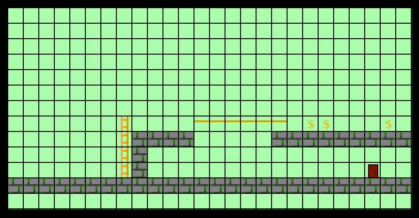

On peut déterminer quels déplacements sont valides pour chaque case,
indépendemment de la position du joueur :

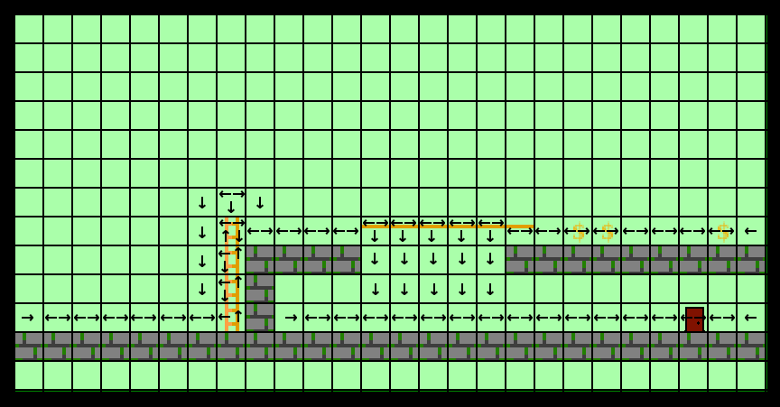


Une façon efficace de décider par où aller est d'utiliser une
recherche *breadth first* (ou fouille en largeur) dans le graphe des
déplacements possibles.

On part d'une position initiale, où on fixe la distance à 0 :

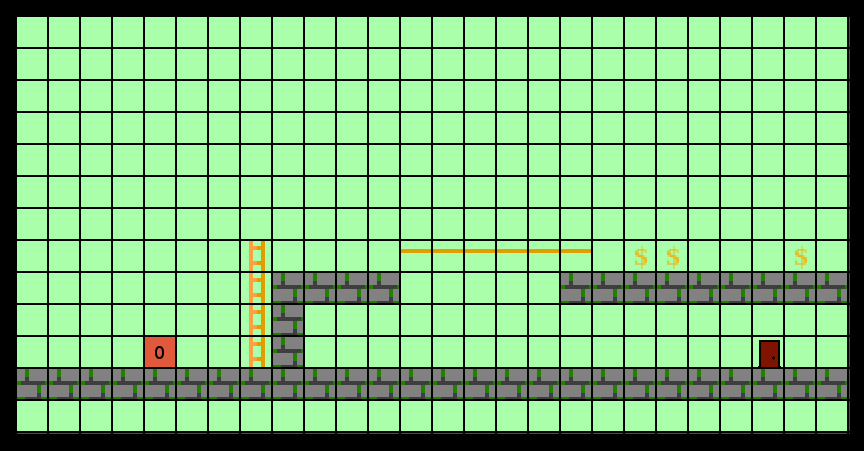


Et pour chaque voisin accessible depuis la position, on calcule leur
distance à la position initiale (un de plus que la position
considérée) et on ajoute ces voisins à une liste de cases à visiter
plus tard (cases marquées en jaune) :


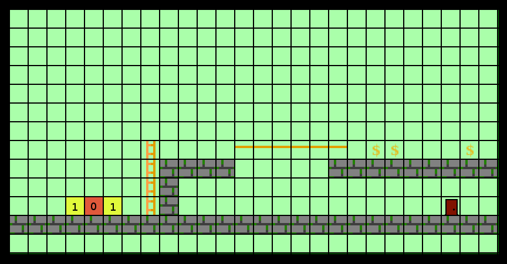

Lorsqu'on a visité tous les voisins de la case actuelle, on recommence
à partir de la première case sur la file d'attente :

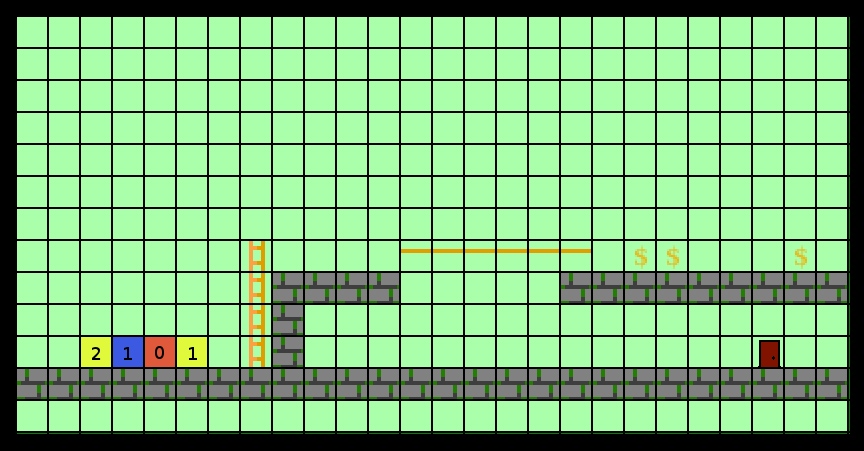
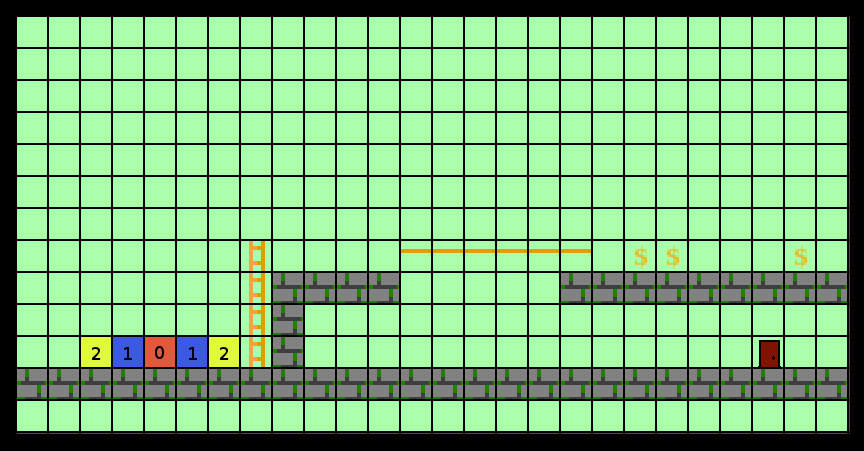

On continue jusqu'à arriver à une case intéressante (soit parce
qu'elle contient un lingot d'or, soit parce qu'on a terminé de
collecter l'or et que c'est la sortie)

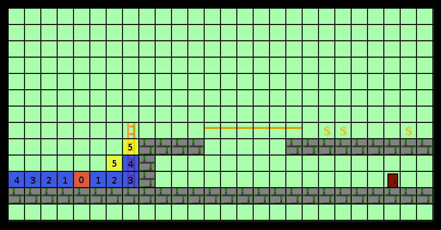
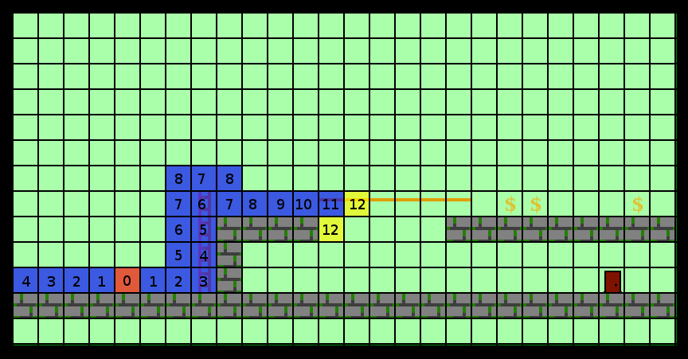
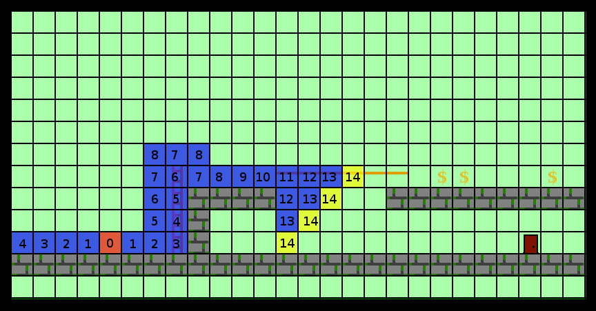
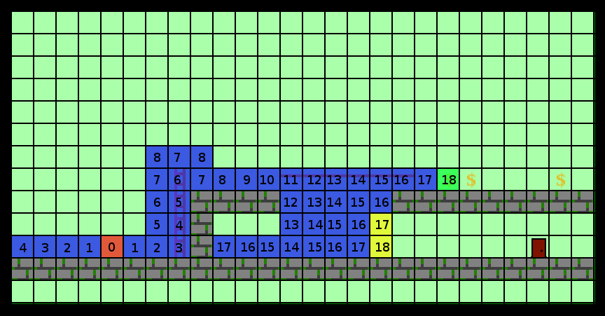


Lorsqu'on trouve une case intéressante, on part de cette case et on
suit les cases ayant la valeur de distance la plus petite jusqu'à
retrouver la position de départ :

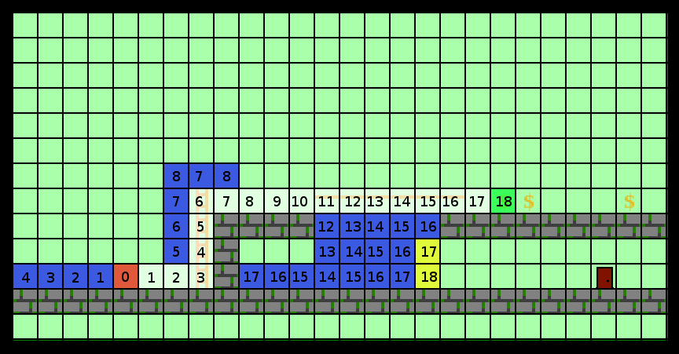


Cet algorithme va vous donner le chemin le plus court pour passer de
votre position jusqu'à la case d'intérêt la plus proche.


Si jamais vous faites les niveaux bonus, vous remarquerez que ce n'est
pas systématiquement la bonne chose à faire...

<!--
#### Pseudo-code


```js
/**
 * start est un enregistrement du type : {x: ..., y: ...}
 * target est un type de case à trouver (soit '$', soit 'S')
 */
function findPath(start, target) {

    // Créer un tableau des coûts
    // Définir le coût de la position de départ à 0
    // Initialiser la liste de cases à vérifier à : [start]

    // Tant qu'on n'a pas trouvé une case visée (selon la variable target) :
        // Prendre la prochaine position à vérifier

        // Pour chaque case non visitée dans les 4 voisins :
            // On calcule son coût qu'on stocke dans la carte de coûts
            // On ajoute la case aux prochaines cases à vérifier


    // Une fois la case de destination trouvée, on calcule le chemin à prendre :
    /* On part de la destination et avance vers la case ayant la plus
       petite valeur de coût, jusqu'à arriver à la case de départ */

    return chemin;
}
```
-->


### Affichage du jeu (`tp2-graphique.js`)

Un affichage primitif (ASCII) vous est déjà donné dans
`tp2-graphique.js`. Pour le voir, vous devez lancer un client de
joueur dans node et ouvrir la page `index.html` dans votre navigateur
(voir la section *1 - Introduction*).

Vous devrez modifier le code de la fonction `draw()` pour arriver à
quelque chose de (discutablement) plus joli. La fonction est appelée
automatiquement à chaque tour et reçoit en paramètre une
représentation textuelle de la grille.

Pour l'affichage graphique, vous pouvez utiliser les images fournies
dans `img/*.png`

La façon la plus simple de dessiner la grille de jeu est en créant un
élément HTML `<table>` avec autant de cellules `<td>` que de cases
dans la grille et en changeant le `background-image` associé à chaque
case pour refléter ce que la grille contient. Ce n'est pas très
efficace, mais ça devrait faire l'affaire pour ce TP\footnote{Notez :
Si jamais vous souhaitez aller un peu plus loin, vous pouvez fouiller
sur l'utilisation des `<canvas>`, qui sont beaucoup plus efficaces
pour dessiner des images arbitraires sur l'écran.  }. Un exemple de
génération de `<table>` est donné dans la fonction `draw()`, vous
pouvez vous en inspirer pour faire votre fonction.

Le résultat final de votre page web devrait ressembler à quelque chose comme :

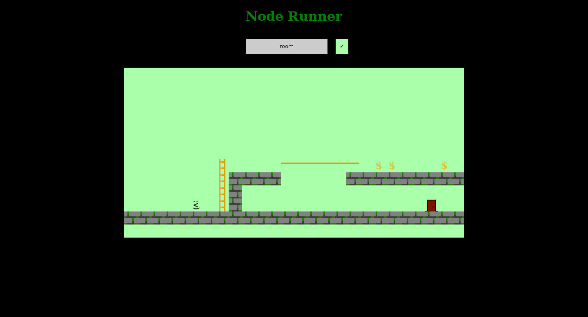


\newpage

## 4. Évaluation

* 30% sur l'affichage graphique en HTML
    - La grille de jeu est affichée sans erreur
* 40% sur l'intelligence artificielle
    - Votre IA doit *réussir* les niveaux 1 à 4 inclusivement
* **3% bonus** par niveau atteint à partir du 5ème niveau (donc 3%
    bonus si vous réussissez le niveau 5, et 12% bonus si vous
    réussissez tout jusqu'au niveau 8)
* 30% sur la qualité du code (le style, les commentaires, le découpage
  fonctionnel, le choix des noms de fonctions et de variables, etc.)
* *15% de pénalité & les points bonus ne sont pas comptés si le travail est fait
  individuellement*

---------------------

## 5. Indications supplémentaires

- **Vous aurez besoin d'une connexion internet pour faire ce TP**. Si
  jamais c'est un problème, assurez-vous de trouver une solution avec
  un démonstrateur rapidement.
- Vous devez faire le travail par groupes de 2 personnes. Indiquez vos
noms clairement dans les commentaires au début de votre code. Un
travail fait seul engendrera une pénalité (qui ne peut pas être
compensée par les points bonus). Les équipes de plus de deux seront
refusées.
- Vous devez seulement remettre deux fichiers : tp2-graphique.js et
  tp2-ai.js
- Voici les critères d’évaluation du code :
    - l'exactitude (respect de la spécification)
    - l'élégance et la lisibilité du code
    - la présence de commentaires explicatifs lorsque nécessaire
    - le choix des identificateurs
    - la décomposition fonctionnelle et le choix de tests unitaires
      pertinents
- De plus :
    - La performance de votre code doit être raisonnable.
    - Chaque fonction devrait avoir un bref commentaire pour indiquer
      ce qu’elle fait.
    - Il devrait y avoir des lignes blanches pour que le code ne soit
      pas trop dense (utilisez votre bon sens pour arriver à un code
      facile à lire)
    - Les identificateurs doivent être bien choisis pour être
      compréhensibles (évitez les noms à une lettre, à l’exception de
      i, j, ... pour les variables d'itérations des boucles for).
    - Vous devez respecter le standard de code pour ce projet (soit,
      les noms de variables en camelCase).
    - Il ne devrait plus y avoir de code de debug (aka,
      `console.log(...)`) dans la version finale remise.
- Il y a une pénalité de 33% pour chaque jour de retard
